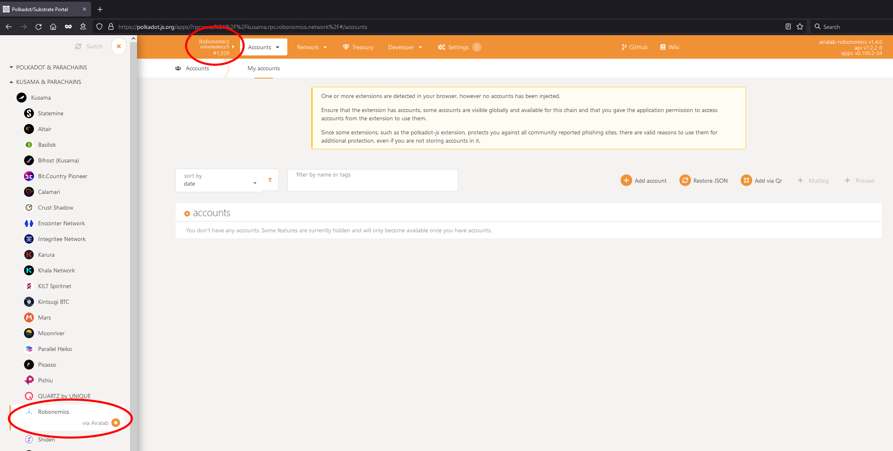
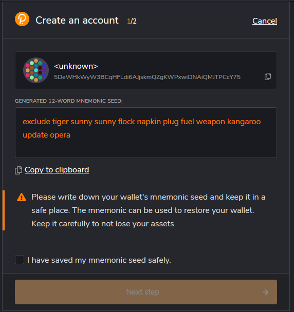
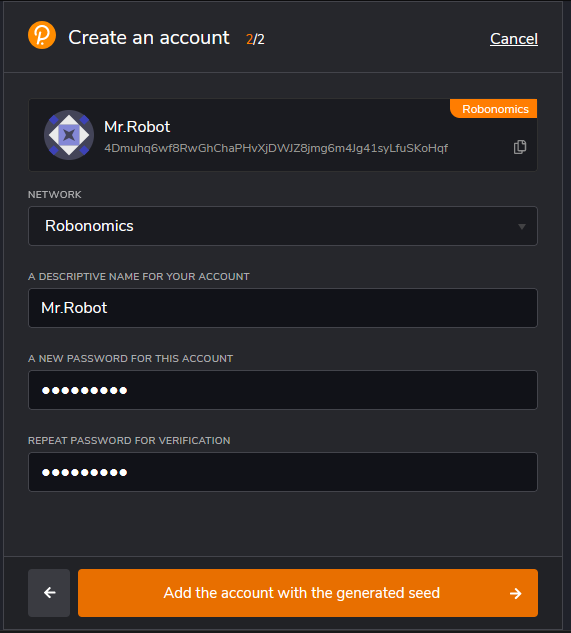
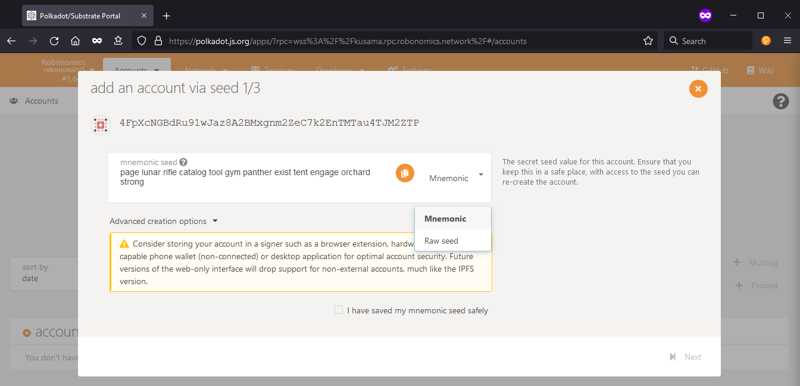
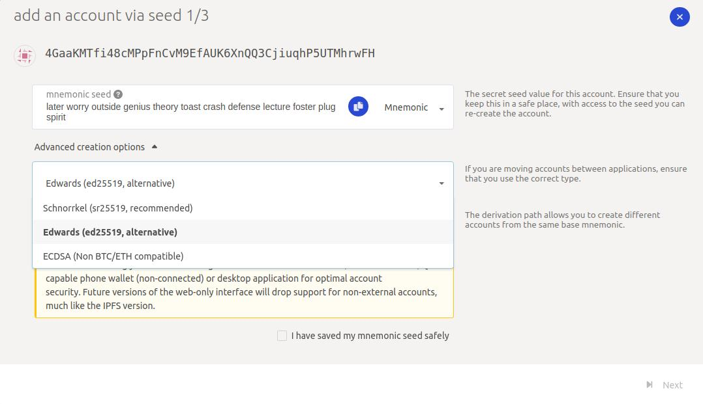
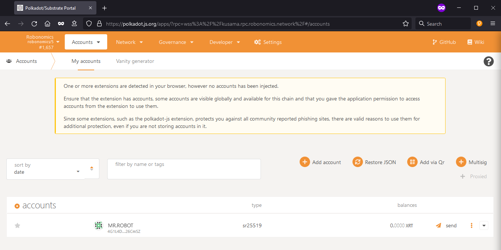
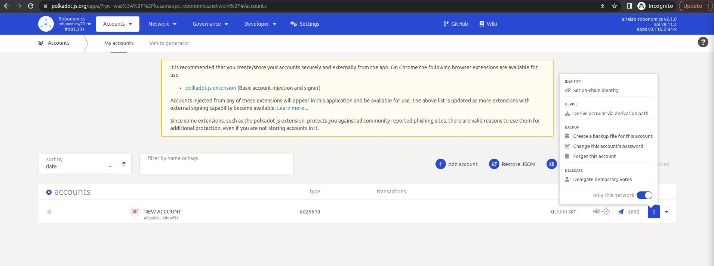
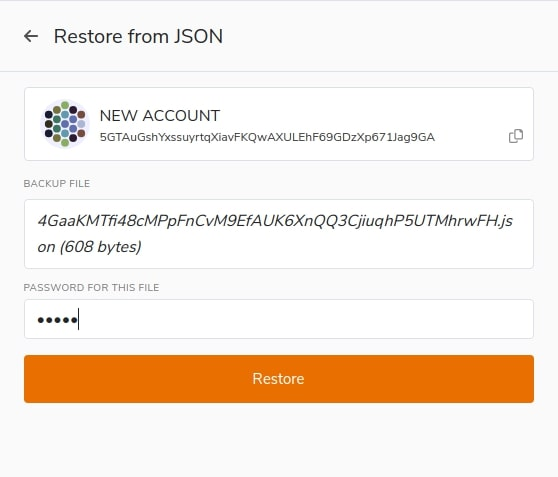

**Чтобы взаимодействовать с парачейном Робономики, разработчикам и пользователям нужно создать аккаунт на портале Polkadot/Substrate. Аккаунт осуществляет базовые функции в сети - служит Вашим публичным адресом в сети (публичным ключом), дает доступ к контролю адреса и средств (приватный ключ), позволяет совершать транзакции в сети, показывает Ваши токены и их количество и т.д. Ниже рассмотрены два главных способа создания аккаунта для парачейна Робономики.**

## 1. С помощью расширения для браузера Polkadot{.js}

Расширение Polkadot предоставляет способ создать аккаунт и взаимодействовать со всеми проектами Полькадот/Кусамы, включая парачейн Робономики. Это не самый безопасный способ управления аккаунтом, но он самый удобный по соотношению безопасности и удобства использования. 

## 1.1. Установить расширение для браузера

Расширение для браузера доступно для [FireFox](https://addons.mozilla.org/en-US/firefox/addon/polkadot-js-extension) и [Google Chrome](https://chrome.google.com/webstore/detail/polkadot%7Bjs%7D-extension/mopnmbcafieddcagagdcbnhejhlodfdd?hl=ru) (а также для браузеров на базе Chromium).

## 1.2. Открыть приложение для парачейна Робономики

Откройте [приложение для парачейна Робономики](https://polkadot.js.org/apps/?rpc=wss%3A%2F%2Fkusama.rpc.robonomics.network%2F#/) на портале Polkadot/Substrate. Если Вы впервые пользуетесь порталом, он запросит доступ к расширению для браузера, предоставьте доступ.

После открытия приложения обратите внимание на верхний левый угол - здесь указаны название сети, ее значок и номер последнего блока. Кликнув на эту область, Вы увидите список всех сетей Полькадот/Кусамы, включая тестовые сети и локальные ноды. Вы можете переключиться между сетями, выбрав нужную Вам сеть и нажав кнопку `Switch`. **Убедитесь, что вы подключились к парачейну Робономики**. 

## 1.3. Обновить метаданные расширения

Вполне вероятно, приложение попросит Вас обновить метаданные расширения, чтобы информация о сети, к которой Вы подключены, отображалась корректно. Перейдите в **Settings -> Metadata**, нажмите кнопку `Update metadata`, после чего появится всплывающее окно, где необходимо дать приложению разрешение на это действие.

## 1.4. Создать аккаунт в расширении

Откройте расширение для браузера Polkadot{.js}. Кликните на большую кнопку "+" или выберете `Create new account`, нажав на маленькую икноку "+" в верхнем правом углу. Вы должны увидеть следующее меню со сгенерированной мнемотической фразой из 12 слов и адресом.

Сид-фраза - это ваш ключ к аккаунту. Зная ее, Вы или любой другой человек может получить контроль над аккаунтом и даже пересоздать его в случае потери пароля. **Очень важно хранить сид-фразу в надежном месте**, лучше всего на бумаге или других нецифровых носителях информации, а не на цифровом носителе или компьютере. 

Сохраните сид-фразу и нажмите `Next step`. Вы должны увидеть следующее меню.

- *Network* позволяет выбрать, для какой сети будет использоваться этот аккаунт. Вы можете использовать один и тот же адрес в разных сетях, однако по соображениям безопасности рекомендуется создать новый адрес для каждой сети, с которой Вы взаимодействуете.
В выпадающем списке выберете сеть Робономики. Если вы не смогли ее найти, скорее всего, вы не обновили метаданные. Вернитесь назад и сделайте это.

    - Вы заметите, что формат адреса и иконка аккаунта изменились - это нормально. Разные форматы сети - просто разные представления одного и того же публичного ключа. 

- *Name* - это просто название аккаунта исключительно для Вашего пользования. Оно не записывается в блокчейне и не видно другим пользователям. 

- *Password* используется для шифровки информации о Вашем аккаунте. Вам нужно будет заново вводить его при подписании транзакций на портале. Создайте пароль и запомните его.

После создания аккаунта Вы увидите его в списке аккаунтов в расширении Polkadot{.js}. Кликнув на многоточие, Вы сможете переименовать аккаунт, экспортировать его, удалить его из расширения, а также изменить сеть для этого аккаунта.

Кроме того, аккаунт появится в меню **Accounts -> Accounts** на портале, где будет отмечено, что он был добавлен с помощью расширения.

## 2. Непосредственно в приложении для парачейна Робономики

Вы можете создать аккаунт на портале Polkadot/Substrate с помощью пользовательского интерфейса, хотя это не рекомендуется, так как это менее безопасный метод создания аккаунта. Его следует использовать, когда другие способы не подходят или в целях разработки и тестирования.

## 2.1. Открыть приложение для парачейна Робономики

Перейдите в [приложение для парачейна Робономики](https://polkadot.js.org/apps/?rpc=wss%3A%2F%2Fkusama.rpc.robonomics.network%2F#/) на портале Polkadot/Substrate. **Проверьте в верхнем левом углу, что вы подключены к парачейну Робономики**.  

Перейдите в **Accounts -> Accounts** и нажмите кнопку `Add account`. 

## 2.2. Создать аккаунт

Вы должны увидеть следующее всплывающее окно с сид-фразой аккаунта. 

У нее есть две формы: *Mnemonic* (человекочитаемая) и *Raw* (последовательность цифр и букв). Сохраните сид-фразу в надежном месте и нажмите `Next`.

> Так же вы можете поменять тип шифрования аккаунта, для этого откройте `Advances creation options` и выберите тип (на картинке `ED25519`).

В следующем меню нужно задать имя и пароль аккаунта, как было рассмотрено выше в инструкции для расширения.

Кликнув на кнопку `Next`, Вы увидите последнее окно. Нажмите `Save`, чтобы завершить создание аккаунта. Это также сгенерирует резервный файл JSON, который нужно сохранить в надежном месте. Вы можете использовать этот файл позже для восстановления аккаунта, если помните пароль.

## 2.3 Добавить аккаунт типа ed25519 в Polkadot расширение

Вам может понадобиться добавить аккаунт в раширение Polkadot.js (для аккаунтов типа ed25519 это возможно только с использованием JSON файла). Для этого создайте JSON файл для нужного аккаунта: на портале нажмите на три точки справа от аккаунта и нажмите `Create a backup file for this account`, потом введите пароль.

Далее откройте расширение и нажмите `+` в правом верхнем углу, выберите `Restore account from backup JSON file`.

Перетащите в открывшееся окно ранее сохраненный файл, введите пароль и нажмите `Restore`.

## 3. Аккаунт успешно создан

Теперь Вы можете делать любые операции с только что созданным аккаунтом. Отправляйте и получайте токены, сообщения, пишите даталог и др. Исследуйте все функции приложения. Чтобы скопировать адрес Вашего аккаунта, просто кликните по его иконке и адрес скопируется в буфер обмена.

Если Вы хотите узнать больше об аккаунтах Polkadot/Kusama, а также о дополнительных способах их создания, посетите [эту](https://wiki.polkadot.network/docs/learn-accounts) и [эту](https://wiki.polkadot.network/docs/learn-account-generation) страницу.
