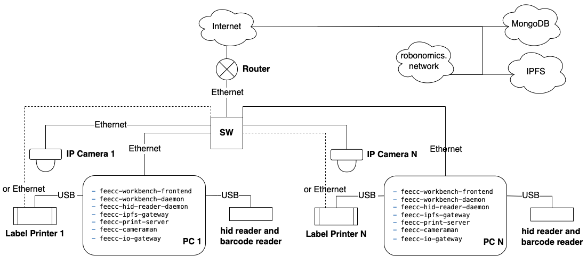
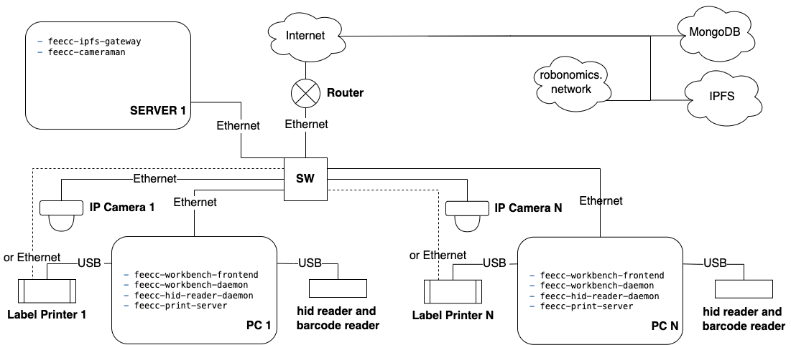

## Описание архитектуры
Платформа Feecc состоит из нескольких сервисов, таких как:
- [feecc-analytics-frontend](https://github.com/Multi-Agent-io/feecc-analytics-frontend)
- [feecc-analytics-backend](https://github.com/Multi-Agent-io/feecc-analytics-backend)
- [feecc-workbench-frontend](https://github.com/Multi-Agent-io/feecc-workbench-frontend)
- [feecc-workbench-daemon](https://github.com/Multi-Agent-io/feecc-workbench-daemon)
- [feecc-validator-frontend](https://github.com/Multi-Agent-io/feecc-validator-frontend)
- [feecc-validator-backend](https://github.com/Multi-Agent-io/feecc-validator-backend)
- [feecc-ipfs-gateway](https://github.com/Multi-Agent-io/feecc-ipfs-gateway)
- [feecc-print-server](https://github.com/Multi-Agent-io/feecc-print-server)
- [feecc-cameraman](https://github.com/Multi-Agent-io/feecc-cameraman)
- [feecc-hid-reader-daemon](https://github.com/Multi-Agent-io/feecc-hid-reader-daemon)
  
Каждый сервис отвечает за тот или иной функционал необходимый для развертывания в корпоративной среде.

### Feecc Рабочее Место Инженера

Feecc Рабочее Место Инженера обычно состоит из следующих контейнеров:
Установка обязательна на компьютер с которого производится сборка изделия.
- feecc-workbench-frontend
- feecc-workbench-daemon
- feecc-hid-reader-daemon
Установка может быть осуществлена как на компьютер с которого производится сборка изделия так и на сервер или другое устройство в локальной сети.
- feecc-ipfs-gateway
- feecc-print-server
- feecc-cameraman

На рисунке 1 и 2 изображенны архитектуры Feecc Рабочее Место Инженера с децентрализованной и централизованной топологией организации системы в корпоративной среде.

Рисунок 1 - Архитектура Feecc Рабочее Место Инженера с децентрализованной топологией организации системы в корпоративной среде.

Рисунок 2 - Архитектура Feecc Рабочее Место Инженера с централизованной топологией организации системы в корпоративной среде.

Выбор топологии и развертывание различных комбинаций зависит от существующей сети передачи данных компании, установленных компьюетров, требований к надежности, централизации или децентрализации и многого другого. Все микросервисные приложения поддерживают обмен данными по IP сети между собой. 

### Feecc Аналитика
Feecc Аналитика зависит от работы следующих контейнеров:
- feecc-analytics-frontend
- feecc-analytics-backend

### Feecc Валидатор
Feecc Валидатор зависит от работы следующих контейнеров:
- feecc-validator-frontend
- feecc-validator-backend