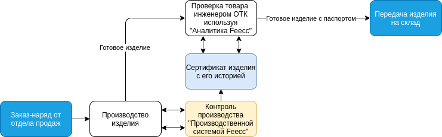

Feecc — это платформа, разработанная [Multi-Agent Systems](http://multi-agent.io), позволяющая предприятиям создавать и настраивать собственные системы контроля качества продуктов или услуг в соответствии с бизнес задачами.

## Основная идея
С помощью технологий web3 и набора гибких программных модулей платформа Feecc позволяет организовывать процесс производства любого типа продукции, проводить аудит доступа сотрудников к рабочему месту и извлекать все данные о рабочих процессах. Информация хранится в неизменном и безопасном хранилище в распределенном хранилище IPFS, хэши данных сохраняются в даталог robonomics.network с возможностью доступа для отдела контроля качества через Feecc Аналитика. Благодаря Feecc предприятие может не только оцифровать свои процессы и избавиться от бумажной бюрократии и судебных исков, но и привлечь внимание новых потребителей к продукту, повысив доверие к нему.

Платформа представляет из себя набор программного обеспечения для осуществления контроля за производственным процессом и сбора информации для последующего анализа ОТК или другими участниками. Глобально схему интеграции платформы в бизнесс-процесс можно представить так:

## Возможности платформы

### Надежное и безопасное хранение данных
Feecc использует безопасное хранилище данных на основе архитектуры с адресацией по содержимому и распределенного реестра, чтобы гарантировать надежность и достоверность собранных данных рабочего процесса.

### Четкая связь сотрудника с продуктом
Feecc отслеживает все этапы рабочего процесса с помощью видеозаписи, регистрации данных с периферийных устройств и авторизации доступа сотрудников. Платформа поддерживает любой последовательный рабочий процесс, включая долгосрочные или прерываемые операции.

### Цифровой сертификат продукта
Все цифровые следы рабочего процесса сводятся в единый сертификат изделия с уникальным идентификатором, который затем прикрепляется в виде QR-кода к изделию. Feecc может добавлять в сертификат пользовательские параметры процесса и автоматизировать его создание даже для составных изделий.

### Широкая поддержка переферийных устройств
Feccc поддерживает стандартные цифровые интерфейсы ввода-вывода для подключения различных устройств (видеокамер, сканеров, принтеров и т. д.).

## Видео демонстрации работы Feecc Рабочее Место Инженера
https://www.youtube.com/watch?v=WhtOJtGjAok