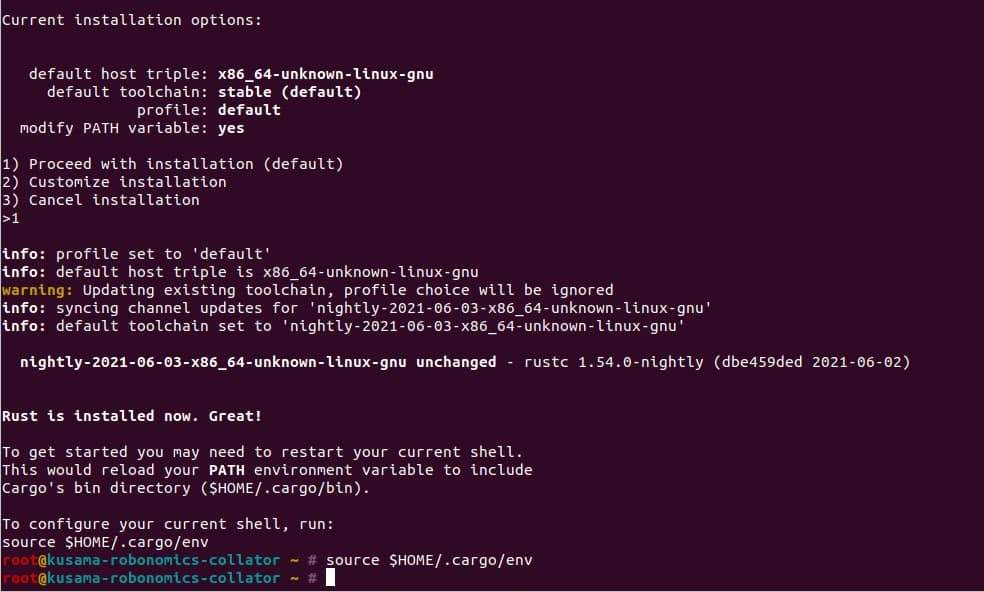
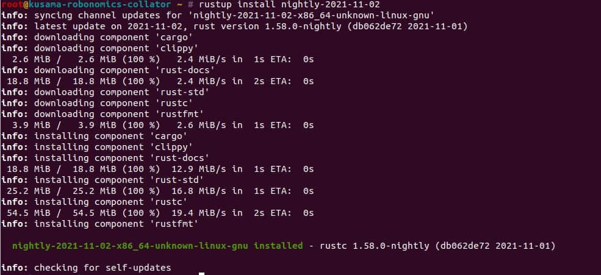
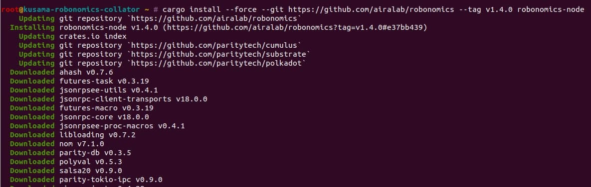
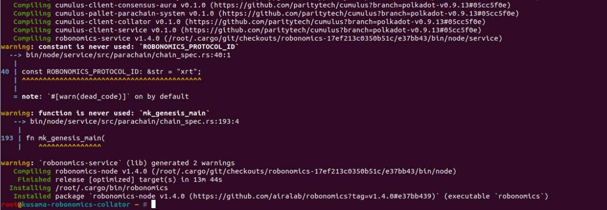

<robo-wiki-note type="note" title="Note">
  В видео и скриншотах этой статьи мы использовали версию 1.4.0 Robonomics. Вам нужно использовать те же команды, но заменить версию Robonomics на текущую.
</robo-wiki-note>

## Что такое коллатор

Коллатор является частью парачейна Robonomics. Этот тип узла создает новые блоки для цепи.

>Коллаторы поддерживают парачейны, собирая транзакции парачейна от пользователей и создавая доказательства перехода состояния для валидаторов цепи ретрансляции. Другими словами, коллаторы поддерживают парачейны, агрегируя транзакции парачейна в кандидаты на блоки парачейна и создавая доказательства перехода состояния для валидаторов на основе этих блоков.

Вы можете узнать больше о коллаторе на связанной [странице вики Polkadot](https://wiki.polkadot.network/docs/learn-collator)

В парачейне Robonomics каждый коллатор получает вознаграждение (**0.000380520 XRT**) за каждый построенный блок, если этот блок был запечатан в цепь. 
Также коллатор получает **50% комиссии за транзакции** с этого блока.

## Процесс сборки

https://youtu.be/wnAtD7w0Pxk

Убедитесь, что у вас установлен Rust и необходимое программное обеспечение. Установщик Rust спросит вас о текущих параметрах установки, вы должны выбрать опцию `1) Продолжить установку (по умолчанию)`.


```
  curl https://sh.rustup.rs -sSf | sh
  # on Windows download and run rustup-init.exe
  # from https://rustup.rs instead
  source $HOME/.cargo/env
```



Установите необходимую ночную цепочку и цель wasm.
Следующие команды актуальны для Robonomics v2.6.0:

```
  rustup install nightly-2022-08-05
```



```
  rustup default nightly-2022-08-05
  rustup target add wasm32-unknown-unknown --toolchain nightly-2022-08-05
```
Вам также потребуется установить следующие пакеты:

  1. Linux:

  ```
    sudo apt install cmake git clang libclang-dev
  ```
  2. Mac:

  ```
    brew install cmake pkg-config git llvm
  ```
  3. Windows (PowerShell):

  ```
    # Install git https://git-scm.com/download/win
    # Install LLVM
    # Download and install the Pre Build Windows binaries
    # of LLVM  from http://releases.llvm.org/download.html
  ```
Теперь вы можете установить узел robonomics из исходного кода git.

```
  cargo install --force --git https://github.com/airalab/robonomics --tag v2.6.0 robonomics-node
```




После этой команды скомпилированный двоичный файл robonomics будет находиться в каталоге `~/.cargo/bin`.

Следующий шаг - это запуск узла коллатора. Вы можете прочитать об этом в статье ["Как запустить коллатор Robonomics"](/docs/how-to-launch-the-robonomics-collator).