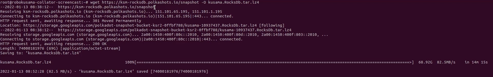
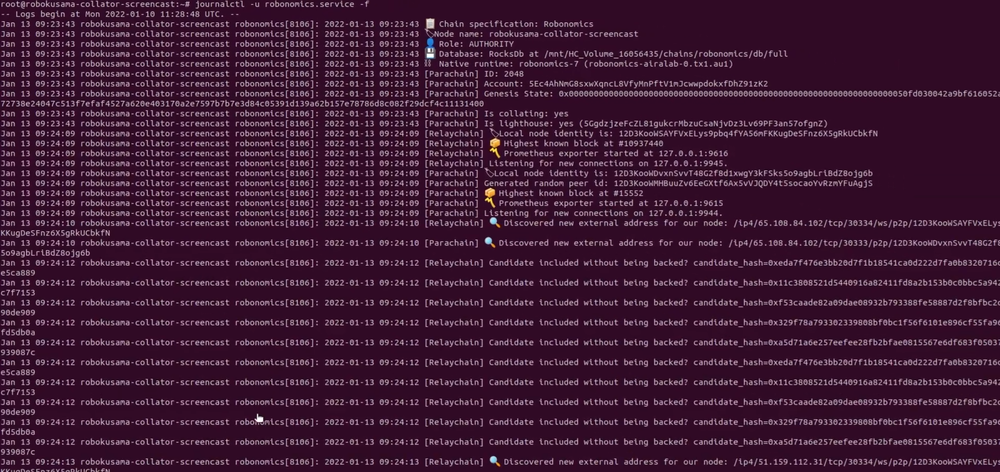

Note: In the screencast and screenshots of this article, we used version 1.4.0 of Robonomics. You need to use the same commands, but replace the version of Robonomics with the current one.

https://youtu.be/wUTDDLDbzTg

Currently the Robonomics network is maintained by developers, but anyone can support the project. Every additional full node of the blockchain helps it to be more sustainable and fault tolerant. Robonomics node binaries are available in [release](https://github.com/airalab/robonomics/releases) assets or it could be [built from source](/docs/how-to-build-collator-node/).

## Requirements

**Minimum hardware requirements** for collators:
+ 4-cores CPU
+ 200GB extendable NVMe space
+ 8GB RAM


But we recommend that you launch a collator using the **standard hardware requirements** for [Polkadot validators](https://wiki.polkadot.network/docs/maintain-guides-how-to-validate-polkadot#standard-hardware):
+ CPU - Intel(R) Core(TM) i7-7700K CPU @ 4.20GHz.
+ Storage - A NVMe solid state drive. Should be reasonably sized to deal with the blockchain growth. Currently the Kusama db uses around 90GB of space. We recommend 200-240GB for first months, but it will need to be re-evaluated every six months. Again: The ability to expand this disk space is required.
+ Memory - 64GB ECC


In this article we use next specifications:
+ 4 VCPU
+ 240GB extendable volume for collator's databases
+ 8GB RAM


## Important information
1. We use some variables in these instructions, and you'll need to replace the values for your own in all the commands:
    + **%NODE_NAME%** is the node name. Example: *my-robonomics-kusama-collator*
    + **%BASE_PATH%** is the path to mounted volume. Example: */mnt/HC_Volume_16056435/*
    + **%POLKADOT_ACCOUNT_ADDRESS%** is the account address in the Polkadot ecosystem in SS58 format. Example: *4Gp3QpacQhp4ZReGhJ47pzExQiwoNPgqTWYqEQca9XAvrYsu*

2. Note that you need use *--state-cache-size=0* in the collator's service launch. This parameter is important for the stability of the collator.
You can see more info in the related [issue](https://github.com/airalab/robonomics/issues/234) on github.

## Easily launch a Robonomics collator

You can simply launch a collator directly in the command line to check for errors.
After that we strongly recommend to launch the Robonomics collator as a service.

```
root@robokusama-collator-screencast:~# robonomics \
  --parachain-id=2048 \
  --name="%NODE_NAME%" \
  --validator \
  --lighthouse-account="%POLKADOT_ACCOUNT_ADDRESS%" \
  --telemetry-url="wss://telemetry.parachain.robonomics.network/submit/ 0" \
  --base-path="%BASE_PATH%" \
  --state-cache-size=0 \
  -- \
  --database=RocksDb \
  --unsafe-pruning \
  --pruning=1000
```


## Launch the Robonomics collator as a service

1. Create the user for the service with home directory
    ```
    root@robokusama-collator-screencast:~# useradd -m robonomics
    ```

2. Download, extract and move the Robonomics binary to the */usr/local/bin/* directory. You need to replace *$ROBONOMICS_VERSION* with the current version of Robonomics in the commands in this section. You can find the current version on the [Releases page of the Robonomics repository on github](https://github.com/airalab/robonomics/releases).
   ```
   root@robokusama-collator-screencast:~# wget https://github.com/airalab/robonomics/releases/download/v$ROBONOMICS_VERSION/robonomics-$ROBONOMICS_VERSION-x86_64-unknown-linux-gnu.tar.gz
   root@robokusama-collator-screencast:~# tar -xf robonomics-$ROBONOMICS_VERSION-x86_64-unknown-linux-gnu.tar.gz
   root@robokusama-collator-screencast:~# mv robonomics /usr/local/bin/
   ```
   


3. Create the systemd service file named *robonomics.service*:
    ```
    root@robokusama-collator-screencast:~# nano /etc/systemd/system/robonomics.service
    ```

    And add the following lines in the service file:
    ```
    [Unit]
    Description=robonomics
    After=network.target
    
    [Service]
    User=robonomics
    Group=robonomics
    Type=simple
    Restart=on-failure

    ExecStart=/usr/local/bin/robonomics \
      --parachain-id=2048 \
      --name="%NODE_NAME%" \
      --validator \
      --lighthouse-account="%POLKADOT_ACCOUNT_ADDRESS%" \
      --telemetry-url="wss://telemetry.parachain.robonomics.network/submit/ 0" \
      --base-path="%BASE_PATH%" \
      --state-cache-size=0 \
      -- \
      --database=RocksDb \
      --unsafe-pruning \
      --pruning=1000

    [Install]
    WantedBy=multi-user.target
    ```
    


    ```
    root@robokusama-collator-screencast:~# chown -R robonomics:robonomics %BASE_PATH%
    ```


4. Save this file, then enable and start the service:
    ```
    root@robokusama-collator-screencast:~# systemctl enable robonomics.service root@robokusama-collator-screencast:~# systemctl start robonomics.service
    ```

Telemetry url: https://telemetry.parachain.robonomics.network/#/Robonomics

Collators logs can be monitored with : `journalctl -u robonomics.service -f` 

Now the robonomics collator is launched it will sync with the Kusama Relay Chain, this can take up quite some time depending on your network speed and system specifications, so we recommend to download a Kusama snapshot and use it. 


## Speeding up the sync process using a Kusama snapshot

We recommend to do this immediately after you've created and started the robonomics service. You can find more info about snapshots and usage instructions on the followin page: https://ksm-rocksdb.polkashots.io/

Instructions:

1. Stop the Robonomics service and remove the current Kusama database directory:
    ```
    root@robokusama-collator-screencast:~# systemctl stop robonomics.service
    root@robokusama-collator-screencast:~# rm -rf %BASE_PATH%/polkadot/chains/ksmcc3/db/
    ```
2. Download the actual snapshot and extract it:
    ```
    root@robokusama-collator-screencast:~# wget https://ksm-rocksdb.polkashots.io/snapshot -O kusama.RocksDb.tar.lz4
    root@robokusama-collator-screencast:~# lz4 -c -d kusama.RocksDb.tar.lz4 | tar -x -C %BASE_PATH%/polkadot/chains/ksmcc3
    ```
    


    You can remove the downloaded archive after succesful unpacking:
    ```
    root@robokusama-collator-screencast:~# rm -v kusama.RocksDb.tar.lz4
    ```   
3. Setting the right ownership for the database folder:
    ``` 
    root@robokusama-collator-screencast:~# chown -R robonomics:robonomics %BASE_PATH%/polkadot/chains/ksmcc3
    ```
4. Start the Robonomics service again:
    ```
    root@robokusama-collator-screencast:~# systemctl start robonomics.service
    ```
5. Check service logs:
    ```
    root@robokusama-collator-screencast:~# journalctl -u robonomics.service -f
    ```    
    
