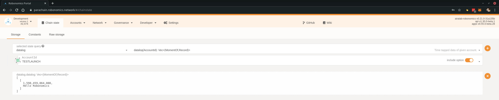

Datalog module allows you to store any string on blockchain

https://www.youtube.com/watch?v=rs67AMyd-gE

For the examples the development network is used. Check [this](/docs/robonomics-test-network-manual/) out to set it up for yourself.

## Requirements

* `robonomics` [executable](https://github.com/airalab/robonomics/releases)
* Account on parachain

You can find instructions on how to create an account [here](/docs/create-account-in-dapp)

## Write

Assuming local node is running:

```
% echo "Hello Robonomics" | ./robonomics io write datalog -s 0xb046fc3c322e91e14a61ad4f08a3809ee0de7092e73aa9b3c2b642a0f476d4d6
```

where `0xb046fc3c322e91e14a61ad4f08a3809ee0de7092e73aa9b3c2b642a0f476d4d6` is a private key for the account with tokens.
In this example the public key is 5H3iRnX16DH2sb2RLxMM8UhDZTvJjP84EhhKXv3sCiEDq6bH. Let's go to the [Robonomics Parachain portal](https://polkadot.js.org/apps/?rpc=wss%3A%2F%2Fkusama.rpc.robonomics.network%2F#/)
and see what happened.

In the Dapp go to Developer -> Chain state. In the "selected state query" list choose datalog and below choose your account. Click plus button on the right and you should see the following:



## Remote
If your local node is configured differently from defaults or you have a remote node, it's possible to specify it with `--remote` option

```
% echo "Hello Robonomics" | ./robonomics io write datalog -s 0xb046fc3c322e91e14a61ad4f08a3809ee0de7092e73aa9b3c2b642a0f476d4d6 --remote https://ipfs.infura.io:5001/
```
