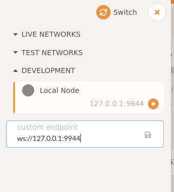

The [crate](https://crates.robonomics.network/robonomics_io/index.html) provides a convenient way to interact with blockchain and includes a set of tools. The latest release can be found [here](https://github.com/airalab/robonomics/releases)

```
% ./robonomics io
robonomics-io 0.21.0
Robonomics Framework I/O operations

USAGE:
    robonomics io [FLAGS] [OPTIONS] <SUBCOMMAND>

FLAGS:
        --dev        Specify the development chain
    -h, --help       Prints help information
    -V, --version    Prints version information

OPTIONS:
    -d, --base-path <PATH>        Specify custom base path
        --chain <CHAIN_SPEC>      Specify the chain specification (one of dev, local, or staging)
    -l, --log <LOG_PATTERN>...    Sets a custom logging filter. Syntax is <target>=<level>, e.g. -lsync=debug

SUBCOMMANDS:
    help     Prints this message or the help of the given subcommand(s)
    read     Read information from device
    write    Write information into device
```

## The Pipeline Philosophy 

The tool is designed in order to be included in a pipeline chain of processes. From Unix user experience everyone is familiar with commands like:

```
ps aux | grep robonomics
```

It means standard output produced by the `ps` program becomes standard input for the `grep` program. 

The `robonomics io` consists of several subcommands with reading, writing abilities or both. It treats everything as a virtual or physical device ([everything is a file](https://en.wikipedia.org/wiki/Everything_is_a_file))

## Read Overview

In general `read` means it reads data from a device or a network and prints it in `stdout`.

How to use it for:

* [ipfs](/docs/rio-ipfs)
* [launch](/docs/rio-launch)

```
% ./robonomics io read
robonomics-io-read 0.4.0
Read information from device

USAGE:
    robonomics io read <SUBCOMMAND>

FLAGS:
    -h, --help       Prints help information
    -V, --version    Prints version information

SUBCOMMANDS:
    help      Prints this message or the help of the given subcommand(s)
    ipfs      Download data from IPFS storage
    launch    Robot launch request events
    pubsub    Subscribe for broadcasing data
    sds011    Nova SDS011 particle sensor
```

## Write Overview

Usually it writes data to blockchain or publishes to pubsub channel. 

How to use it for:

* [datalog](/docs/rio-datalog)
* [ipfs](/docs/rio-ipfs)
* [launch](/docs/rio-launch)

```
% ./robonomics io write
robonomics-io-write 0.4.0
Write information into device

USAGE:
    robonomics io write <SUBCOMMAND>

FLAGS:
    -h, --help       Prints help information
    -V, --version    Prints version information

SUBCOMMANDS:
    datalog    Data blockchainization subsystem command
    help       Prints this message or the help of the given subcommand(s)
    ipfs       Upload data into IPFS storage
    launch     CPS launch subsystem command
    pubsub     Broadcast data into PubSub topic
```

## Local Testnet

For testing purpose it's possible to run the development environment:

```
% ./robonomics --dev --rpc-cors all
```

`--rpc-cors all` allows the [Robonomics Parachain portal](https://polkadot.js.org/apps/?rpc=wss%3A%2F%2Fkusama.rpc.robonomics.network%2F#/) to be connected to local node. After launching the node, go to the dapp, click on Robonomics icon in the upper left corner, choose Development and put node's local address



Finally click Switch and you should be connected to the local node. Check out Accounts tab. There you can create new accounts and transfer tokens.

