## About

"Robonomics coffee" - is a smart coffee machine integrated in  [Robonomics Network](https://robonomics.network/).
This project aims to show Robonomics potential in the IoT sphere by a real-world example.

https://www.youtube.com/watch?v=Z8pXcLjlJnQ

## How to make coffee?

In order to have a cup of delicious coffee, a customer should send some funds (1 Statemine's token 
[ACT](https://statemine.statescan.io/asset/3077), id=3077) to the address of a coffee machine in Statemine parachain.
After that the pouring process is started and action log is published in the 
[Robonomics Parachain portal](https://polkadot.js.org/apps/?rpc=wss%3A%2F%2Fkusama.rpc.robonomics.network%2F#/explorer) 
via Datalog function.

**NOTE!** *You may use **any** token on Statemine, more on that [here](#things-to-point-out)*

## How it works?

There is a single-board computer attached to the body of the coffee machine. This computer is the center of the entire
system, where all the processes are happening. The single-board (Raspberry Pi 4) is connected to the control panel of the 
coffee machine via jumper breadboard wires and GPIO interface. RPI is also the one interacting with Robonomics and
Statemine parachains. Sample flowchart of the workflow is presented below.

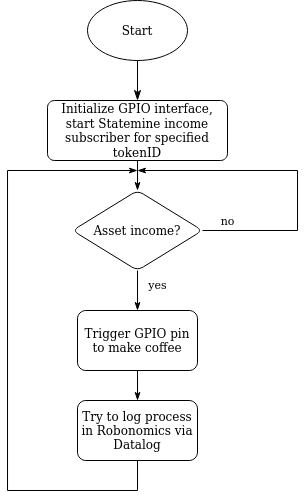

## Tutorial

### Used hardware
- Coffee machine  
The very important criteria for a coffee machine was the ability to solder some wires to the control panel since GPIO
was selected as a communication interface being the easiest one to implement. Several options were considered
([Saeco PicoBaristo HD 8925](https://www.philips.com/c-p/SM5478_10R1/picobaristo-super-automatic-espresso-machine),
[De'Longhi ESAM3200.S](https://www.delonghi.com/en/esam3200-s-ex-1-magnifica-automatic-coffee-maker/p/ESAM3200.S%20EX%3A1)). 
As may be seen, no touchscreen and no bells and whistles, just buttons and espresso. Finally,
[De’Longhi Magnifica ECAM 22.110](https://www.delonghi.com/en/ecam22-110-sb-magnifica-s-automatic-coffee-maker/p/ECAM22.110.SB) 
was chosen as it is cheap and has an easy-removed front panel.
- Single-board [Raspberry Pi 4B](https://www.raspberrypi.com/products/raspberry-pi-4-model-b/) (2 GB) with Ubuntu server
installed via [RPi Imager](https://www.raspberrypi.com/software/).
- 5V adapter and USB A to USB type C cable ([this](https://www.amazon.com/Charger-FOBSUNLAND-Universal-Adapter-S6-Note/dp/B073Q1N8FL/ref=sr_1_2_sspa?keywords=5v+adapter&qid=1636572682&sr=8-2-spons&psc=1&spLa=ZW5jcnlwdGVkUXVhbGlmaWVyPUExQ1JDSkQ5NlBGTFU2JmVuY3J5cHRlZElkPUEwODgwMDgzMUJKMU5YVEdXRjdBWCZlbmNyeXB0ZWRBZElkPUEwMTc3NjgwMldDQ1lJWUkwTVY4VSZ3aWRnZXROYW1lPXNwX2F0ZiZhY3Rpb249Y2xpY2tSZWRpcmVjdCZkb05vdExvZ0NsaWNrPXRydWU=) and [this](https://www.amazon.com/Charger-Braided-Charging-Compatible-Samsung/dp/B0794M53HQ/ref=sr_1_1?keywords=usb+a+type+c+cable&qid=1636572602&sr=8-1) are examples)
- A set of F-M, M-M, F-F jumper wires, a breadboard (again, [this](https://www.amazon.com/Standard-Jumper-Solderless-Prototype-Breadboard/dp/B07H7V1X7Y/ref=sr_1_13?keywords=breadboard&qid=1636572396&sr=8-13) is just an example).
- Transistor and a resistor(optionally). More on that [later](#4-circuit).

### Tools
- A set of screwdrivers.
- Soldering iron with some solder and resin.
- Multimeter.

### Hardware installation
#### 1. Disassembly the coffee machine. 
There is a [sample tutorial](https://www.youtube.com/watch?v=7Y5NCePD0PM) 
on YouTube. Your goal is to remove the front panel (it won't be used anymore, so this is a thing to improve to hide all
the wires) and detach the control PCB.

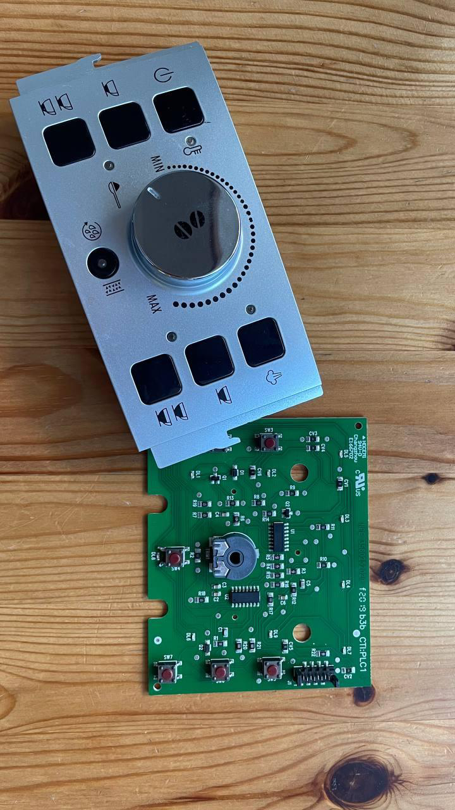

#### 2. Solder two wires to the button you need.
Solder them to the isolated contacts (in our case - two bottom contacts).
You can use any wires, but keep im mind that in the end there should be an M-wire to put it into the breadboard.

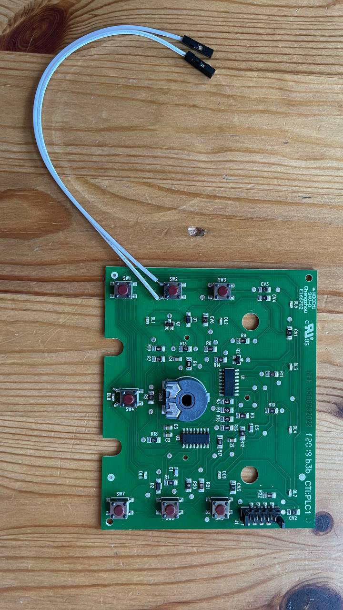

#### 3. Assemble the entire coffee machine back leaving the front panel removed.

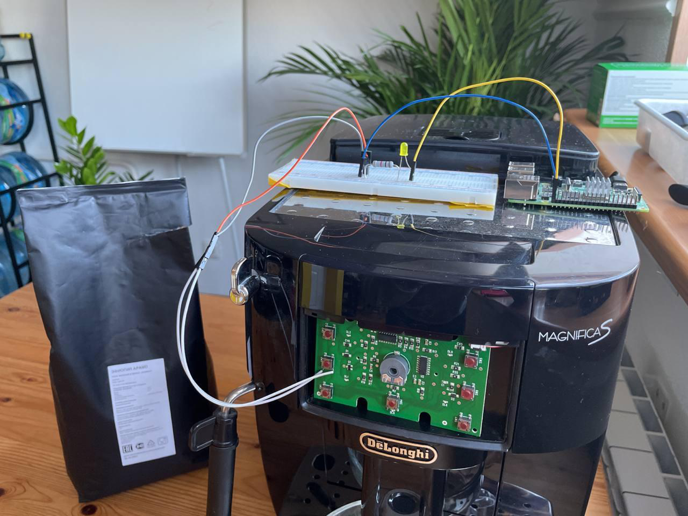

#### 4. Circuit  
Overall circuit is presented below, this is a very simple transistor switch, we used **R<sub>1</sub>**=1k&Omega;, a npn 
transistor **Q<sub>1</sub>** (*h<sub>fe</sub>*=40, *U<sub>ce</sub>*>5V, *I<sub>c</sub>*>0.015A, sample [here](https://alltransistors.com/adv/pdfdatasheet_rca/2n1613.pdf), but almost any general 
transistor suites, since this is a switch) and a small 3.3V diode **D** in base circuit found in the storage of our lab:) One 
can use a MOSFET transistor as well.

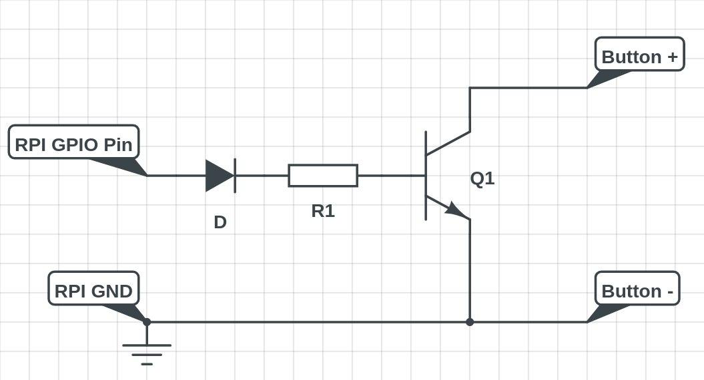

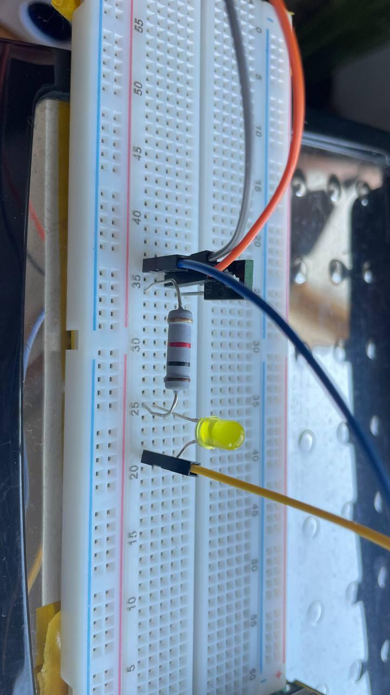

#### 5. Connect coffee machine and RPI
Connect wires marked as *RPI GND* and *RPI GPIO Pin* to pins **GND** and **21** respectively. RPI GPIO scheme is presented below.
Wires marked as *Button+* and *Button-* should be connected to the left button contact and right button contact 
respectively.


### Software installation

Time to turn the Raspberry Pi into blockchain-powered coffee maker!  

#### Option 1: Using Robonomics Parachain in Kusama Network

- Prepare the RPI for Substrate libs ([source](https://www.rust-lang.org/tools/install)):
```bash
curl --proto '=https' --tlsv1.2 -sSf https://sh.rustup.rs | sh
rustup default nightly
```
- Install gpiozero library ([source](https://gpiozero.readthedocs.io/en/stable/installing.html)) and reboot:
```bash
sudo apt update
sudo apt install python3-gpiozero
sudo pip3 install gpiozero
sudo reboot
```
- Clone the repository
```bash
git clone https://github.com/Multi-Agent-io/robonomics-coffee-maker
```
- Install project requirements
```bash
pip3 install -r requirements.txt
```

#### Option 2: Using Everscale Network.

- Install gpiozero library ([source](https://gpiozero.readthedocs.io/en/stable/installing.html)) and reboot:
```bash
sudo apt update
sudo apt install python3-gpiozero
sudo pip3 install gpiozero
sudo reboot
```

- Clone the repository
```bash
git clone https://github.com/Multi-Agent-io/robonomics-coffee-maker
cd robonomics-coffee-maker
```

- Install Node.js requirements
```bash
npm install @eversdk/core
npm install python-shell
mv eversdk.node ~/.tonlabs/binaries/1
git clone https://github.com/tonlabs/ever-sdk-js
cd ever-sdk-js/packages/lib-node
npm install -g
```

The reason why we can't just npm install @eversdk/lib-node is because this library is not compiled for the ARM architecture.


### Account management

#### Option 1: Using Robonomics Parachain in Kusama Network

On your PC install [Polkadot Extension](https://polkadot.js.org/extension/) and register a coffee machine account there. **Save 
mnemonic seed phrase as it is going to be used later.**

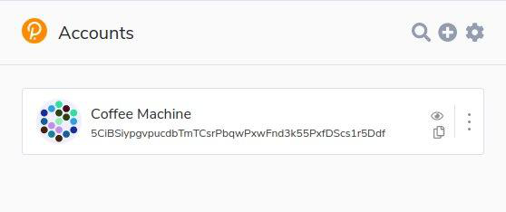

Logging actions in Robonomics is optional, you will need XRT on 
[Robonomics Parachain portal](https://polkadot.js.org/apps/?rpc=wss%3A%2F%2Fkusama.rpc.robonomics.network%2F#/) for coffee machine account (it is the same across
networks) for this. If not, there will simply be an error message *"Balance too low."*

#### Option 2: Using Everscale Network.

Create an account in the Everscale with, for example mobile app. Save seed and activate a coffee-machine address there.
Insert this address in `main.js`

### Run Robonomics coffee

#### Option 1: Using Robonomics Parachain in Kusama Network

Run this in corresponding network repo folder:
```bash
python3 main.py <previously saved seed in quotes>
```
You should see the program waiting for ACT incomes:

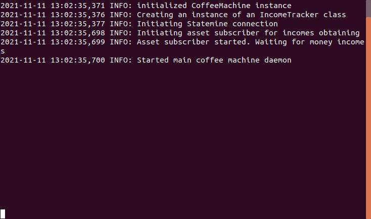

You can send tokens from another account created the same way via `assets:transfer` *extrinsic* on 
[Statemine](https://polkadot.js.org/apps/?rpc=wss%3A%2F%2Fstatemine-rpc.polkadot.io#/explorer).

As soon as there is an income (positive change in `assets:account` *storage function* for address 
derived from seed and for token id `3077`) the RPI triggers GPIO pin 18 and coffee machine starts making coffee and 
records a datalog!

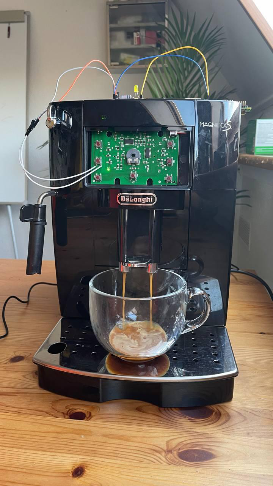

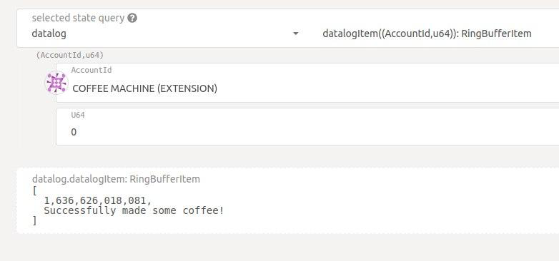

#### Option 2: Using Everscale Network.

Run poller by 
```bash
node main.js
```

Then send 0.5 EVR to the address specified in the `main.js` file. Everscale use case does not imply Datalog recording.

## Things to point out
- This is a POC of a blockchain-driven IoT device, it has things to improve, wires to hide and functionality to implement.
- Token ID, the one, coffee machine is waiting to receive, is set
[here](https://github.com/Multi-Agent-io/robonomics-coffee-maker/blob/master/statemine_monitor.py#L27), **so you can use your own token**,
existing one or newly created. To create one, go to 
[Statemine Kusama parachain page](https://github.com/airalab/robonomics-wiki), `Network -> Assets -> Create`.
Set an ID there, complete the procedure and paste ID in the code.

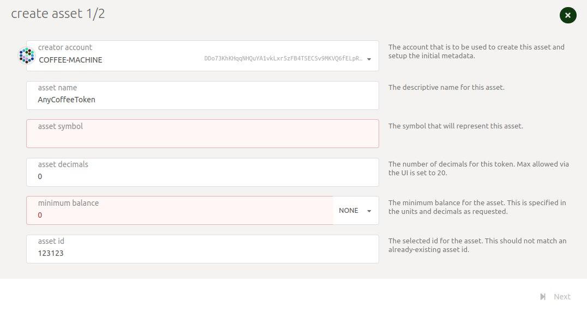


- Right now the only thing that matters for income tracker is the positive difference between current and previous
asset balance. This may be filtered [code](https://github.com/Multi-Agent-io/robonomics-coffee-maker/blob/master/statemine_monitor.py#L59).
- One may use QR-code for mobile apps for convenient transfers.

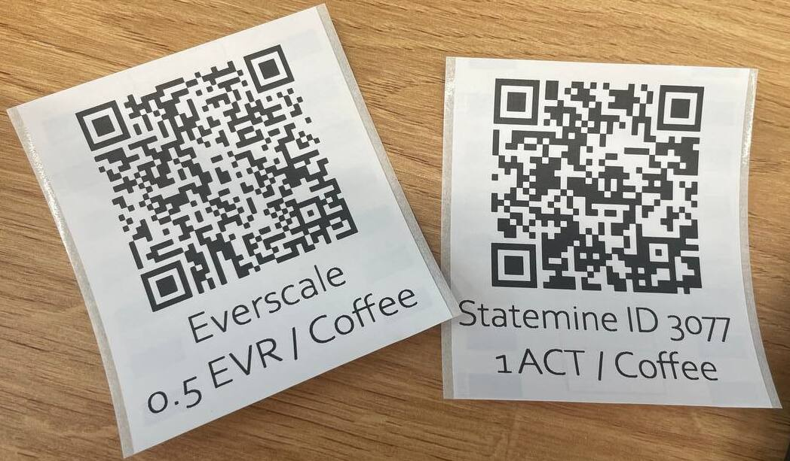

- Powered by [Robonomics](https://robonomics.network/), made by [Multi-Agent.io](https://multi-agent.io/).