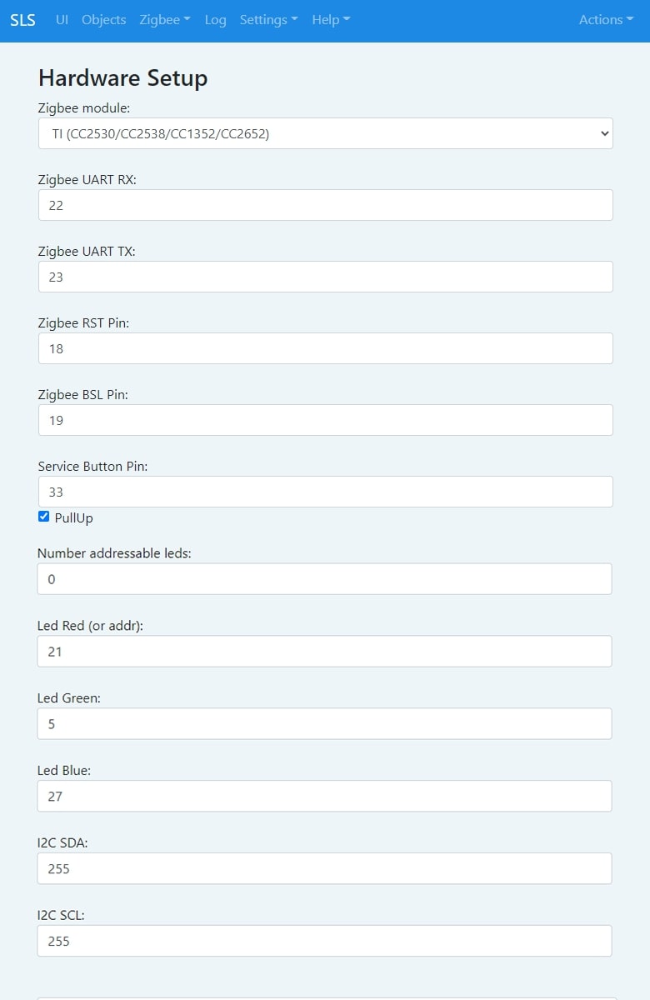
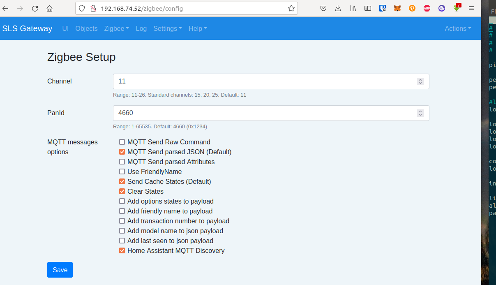

You can use [SLS Gateway from Robonomics](https://easyeda.com/ludovich88/robonomics_sls_gateway_v01) instead of Xiaomi/Aqara gateways. It works only in your local network and don't send any data to external servers, so you can control all data about your home.

## Firmware

If you have clear gateway, first you need to flash it. Download `ESP32_firmware` folder [here](https://drive.google.com/drive/folders/1h_XRUVWM8f5BtzlPs-sxU6WpR_D1mZgC?usp=sharing) and unpack it. Then go to `ESP32_firmware/firmware/20210124_full`. There you can choose folder for your OS. 

1. Set 1 and 3 switches to `on`, others must be off.
2. Connect gateway to your computer via USB type-C port on the gateway.
3. Use `Clear` script.

> For Linux first you need to add permisions:
> ```bash
> sudo chmod +x Clear.sh
> sudo chmod +x Flash_16mb.sh
> ```
4. After that use `Flash_16mb` sript

## Setup

1. Ensure that the switches on the back of the gateway are properly positioned. Switches 5 (RX Zigbee to ESP) and 6 (TX Zigbee to ESP) must be in the ON position, the others must be off. 

2. Connect the type C power cable. The indicator light in the center should turn green.

3. The first time it starts up, the gateway will begin distributing Wi-Fi with the SSID 'zgw****' to set up the SLS gateway connection. Connect to this network. Keep in mind that the signal may be quite weak, so it is best to keep the SLS Gateway closer to your computer. 

4. If the connection is successful, the web interface will open (or you can find it on 192.168.1.1 address). Configure the SLS Gateway to connect to your Wi-Fi by entering the user / pass. After that the gateway's Wi-Fi will shut down. 

5. Find the local IP of the SLS gateway to access the web interface. You can use the command 'arp -a' or 'nmap'. The resulting link should look like this: 'http://192.168.xxx.xxx'.

6. Go to Setting/Hardware and make sure that the settings look like this. Correct the settings if necessary and reboot the gateway:



7. Configure automatically adding devices to Home Assistant. Go to `Zigbee/Config` then tick `Home Assistant MQTT Discovery` and `Clear States`:



8. Connect your devices by going to Zigbee/Join. Press the Enable Join button to connect and put your sensors in pairing mode. 

After that connect it to Home Assistant with the following [guide](/docs/sls-gateway-connect)