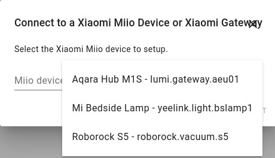
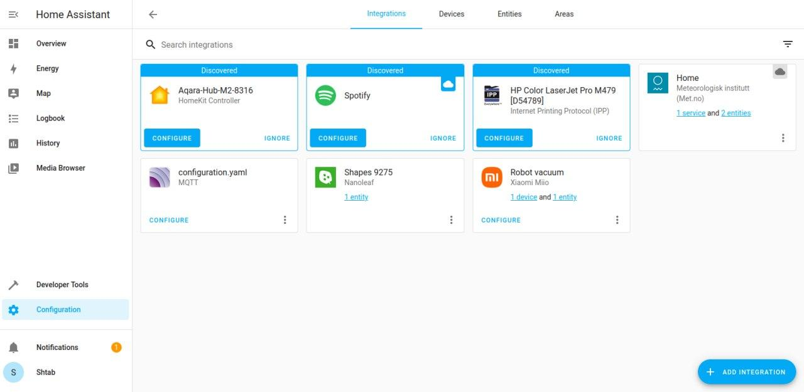

You need your Xiaomi gateway along with all the sensors to be connected to the Mi Home app. If you haven't done this yet press `+` button on the top right corner, find your hub (it must be in connecting mode which is achieved via a long press of the power button) and follow instructions in the app. After you add the gateway, you need to add sensors: press on your gateway, then go to `Child device` and press `+`. Find required device and follow the instructions on the screen. For more details refer to the user manual of your Xiaomi Gateway hub.

## Add Gateway to Home Assistant
Be sure that you're logged in you raspberry as `homeassistant` user, if not do the following:
```bash
sudo -u homeassistant -H -s
```

In your Home Assistant:
```
http://<raspberry_address>:8123
```
Go to `Configuration/Integrations` and press `Add Intagration`. There you need to Find `Xiaomi Miio`:


Then fill your username (or phone) and password from Mi Home account and choose your country server:


Press `Submit` and choose your Hub (Aqara Hub in this example):



Press `Submit` and you will be able to see your gateway in Integrations page.

## Add Gateway to Home Assistant using Homekit Controller integration

You can also connect your hub to Aqara Home app on ios and then add it to Home Assistant through Homekit Controller integration. 

Add your hub to the app using `add device` or `+` button. Right after your hub added to Aqara Home app you will be proposed to bind it with your Homekit account. 


When you see a menu like the picture, open your Home Assistant page:

```
http://<raspberry_address>:8123
```
Go to `Configuration/Integrations`. Here you can find your device discovered and click `Configure` button to add it by Homekit Controller integration. You have to enter pairing code of your device, which you can find on the sticker on your device.




After that you can connect your devices to Robonomics with this [instruction](/docs/add-smart-device-to-robonomics).
