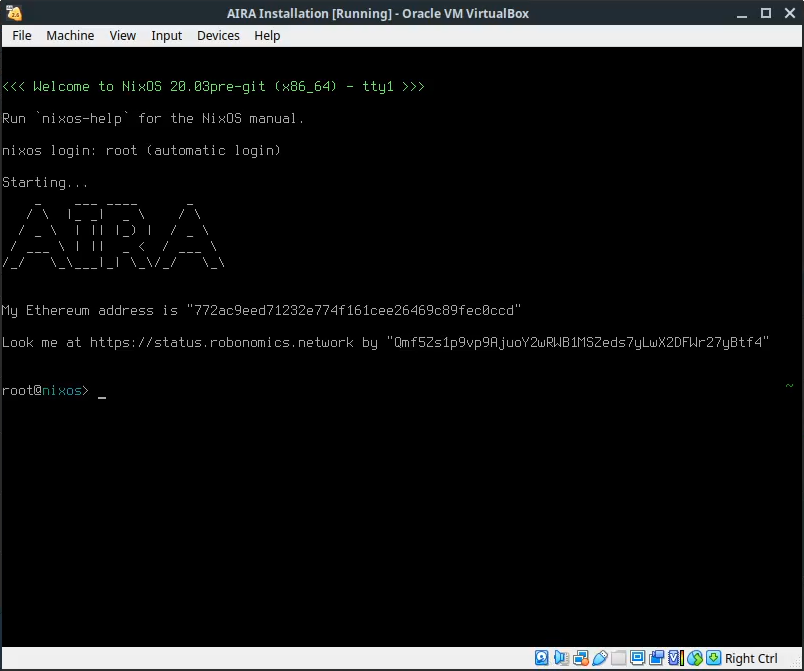

# AIRA Installation on VirtualBox

AIRA is a client for Robonomics Network by Airalab. Basically it's a [NixOS](https://nixos.org/) based operating system.
It's possible to install AIRA on a x86_64 PC. Also there are images for Raspberry Pi 3 and 4 supported by the team.

To get familiar with the OS it's better to start from installing it as a virtual machine in [VirtualBox](https://www.virtualbox.org/).

Requirements:

* VirtualBox
* [VirtualBox Extension Pack](https://www.virtualbox.org/wiki/Downloads#VirtualBox6.1.2OracleVMVirtualBoxExtensionPack)
* 2Gb of RAM for the machine
* 40Gb of free disk space

## Obtain the image

There are channels [stable](https://aira.life/channels/aira-stable/) and [unstable](https://aira.life/channels/aira-unstable/)

To get stable image download the file with `.ova` extension.
For example, the link for stable image is [https://aira.life/channels/aira-stable/nixos-20.03pre-git-x86_64-linux.ova](https://aira.life/channels/aira-stable/nixos-20.03pre-git-x86_64-linux.ova)

!!! note
    Don't forget to check checksum of an image. 

    The last column on the [download](https://aira.life/channels/aira-stable/) page is `SHA-256 hash`. It must be equal to the output of

    ```
    sha256sum nixos-20.03pre-git-x86_64-linux.ova
    ```

There is a walkthrough video you may wish to check out

<iframe width="756" height="425" src="https://www.youtube.com/embed/cDcaypYPBhI" frameborder="0" allow="accelerometer; autoplay; encrypted-media; gyroscope; picture-in-picture" allowfullscreen></iframe>

## Troubleshooting

If you have a fresh installed VirtualBox you need to install the [extension](https://www.virtualbox.org/wiki/Downloads) pack or disable USB 2.0 controller.

Also VirtualBox may show a warning about `Display settings`. Consider switching `Graphics Controller` in settings of the VM to `VMSVGA`.

## Import to VirtualBox

Open VirtualBox and press `Ctrl+I` or go to `File > Import Applicance...`


At this moment the next step is not necessary but it will help you to connect to the VM via SSH easily.

First add `Host-Only` adapter in VirtualBox menu `File > Host Network Manager...` or by pressing `Ctrl+H`


Then go to the image's settings, Network and add the second network adapter


Optionally you can increase the amount of video memory and switch `Graphics Controller` to `VMSVGA`.

## Launch the machine

Finally press Start and you'll see AIRA welcoming you with generated Ethereum address and IPFS identifier



At the very first initialization AIRA generates new Ethereum address and IPNS identifier for you.

