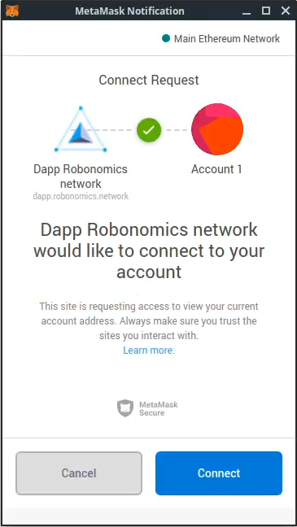
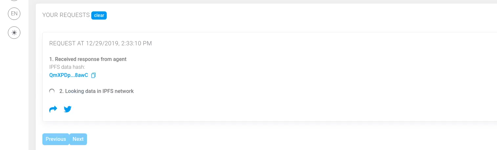

# Get Open Data from Sensor 

Let's start from a quick example of what Robonomics is able to do within 5 minutes.

> Requirements: [Metamask extension](https://metamask.io/)

Open <a href="https://dapp.robonomics.network/#/sensors/airalab/QmbQT8cj9TJKfYVaidfShnrEX1g14yTC9bdG1XbcRX73wY/0x4D8a26e1f055c0b28D71cf1deA05f0f595a6975d/" target="_blank">sensor demo</a> website and follow instructions below

### 1. Open the Dapp

You see the next picture in case you don't have MetaMask extension. Go to the link provided above and install one

### 2. Allow connection to the extension

### 3. Press "Request current values"

### 4. Sign a message. No token or ether are needed

### 5. Wait until the agent collects the data and sends it back

### 6. Wait until the Dapp downloads the result file from IPFS

### 7. Look at the data

Just now you have broadcasted a demand message and got a result from an autonomous agent! The result file is stored in IPFS, the result message is signed with the agent's private key.

