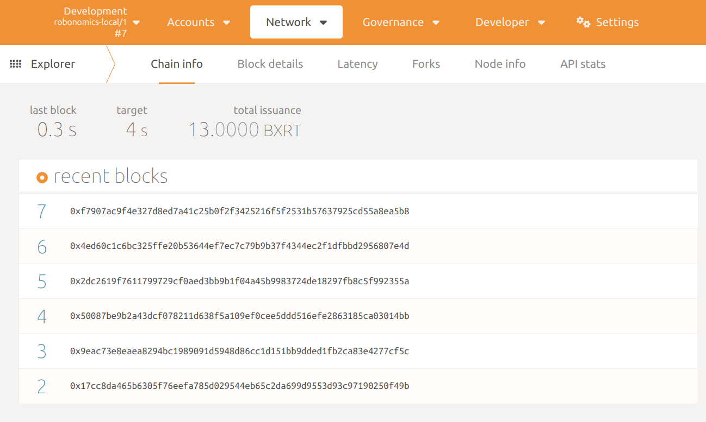

**为了在Robonomics上测试您的应用程序，您可能希望以开发模式运行它。本文介绍了逐步说明
如何获得您自己的本地测试实例的Robonomics。**


## 获取节点二进制文件

1. 首先，您需要一个二进制文件，从最新的[发布](https://github.com/airalab/robonomics/releases)中下载它的存档。

2. 导航到存档文件夹，解压缩二进制文件并更改权限：

```bash
tar xf robonomics-2.4.0-x86_64-unknown-linux-gnu.tar.gz
chmod +x robonomics
```

## 运行

使用以下命令运行节点：

```bash
./robonomics --dev
```
您将看到以下输出：


<robo-wiki-note type="note" title="From Scratch">

  如果您想清除现有的区块，可以通过删除`/tmp/substrate******/chains/dev/db/full`中的RocksDB来执行此操作。
  将`******`替换为启动日志中显示的相应标识符。

  如果您想每次从头开始启动节点，请使用`--tmp`标志。

</robo-wiki-note>

## 连接

现在您可以通过[Polkadot Portal](https://polkadot.js.org/apps/#/explorer)连接到本地节点。

在左上角将网络更改为“Local Node”，然后点击“Switch”。


欢迎来到Robonomics的本地实例！




